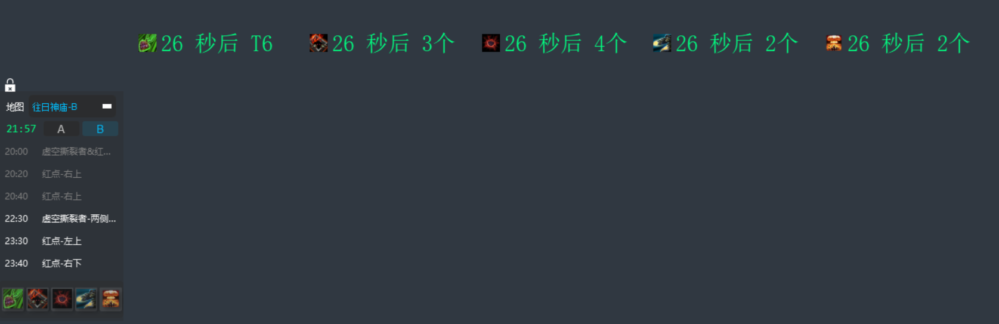

# SC2 Expo

## 项目简介
SC2 Expo 是一个星际争霸2游戏辅助工具，用于识别游戏地图并提供定时提醒功能。

## 环境要求
- Python 3.7 或更高版本
- Windows 操作系统

## 安装步骤
1. 使用国内镜像源安装依赖（推荐）：
```bash
pip install -r requirements.txt -i https://pypi.tuna.tsinghua.edu.cn/simple
```

2. 或者使用默认源安装：
```bash
pip install -r requirements.txt
```

## 启动方式
双击 `start.vbs` 文件即可启动程序。

## 配置说明
在 `src/config.py` 文件中可以修改以下配置项：
在 resource目录下编辑文件内容，来做具体的提醒，红点相关资料参考 https://bbs.nga.cn/read.php?tid=17265336&rand=787

### 调试相关
- `DEBUG_MODE`：调试模式开关（True/False）
- `LOG_LEVEL`：日志级别（'INFO'/'DEBUG'/'WARNING'/'ERROR'）

### 提示窗口设置
- `TOAST_DURATION`：Toast提示窗口显示时间（毫秒）
- `TOAST_OPACITY`：Toast窗口背景透明度（0-255）
- `TOAST_POSITION`：Toast窗口垂直位置（窗口高度的比例，0-1）

### 时间提醒设置
- `TIME_ALERT_SECONDS`：提前提醒时间（秒）

## 界面预览



## 注意事项
1. 确保游戏窗口可见，不要最小化
2. 程序会在系统托盘显示图标
3. 可以通过托盘图标右键菜单退出程序
