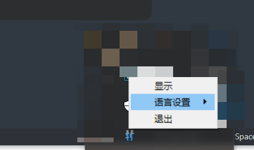
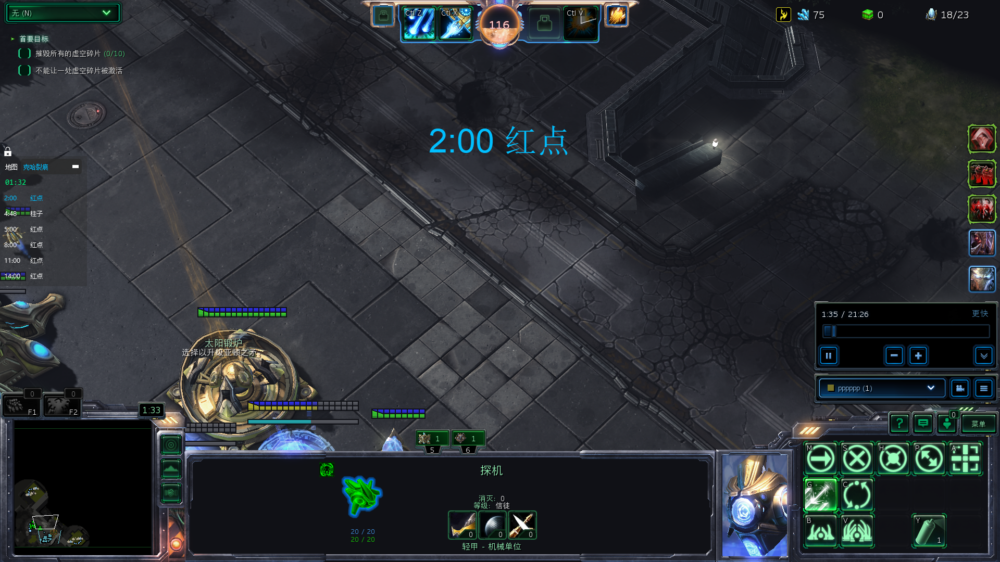
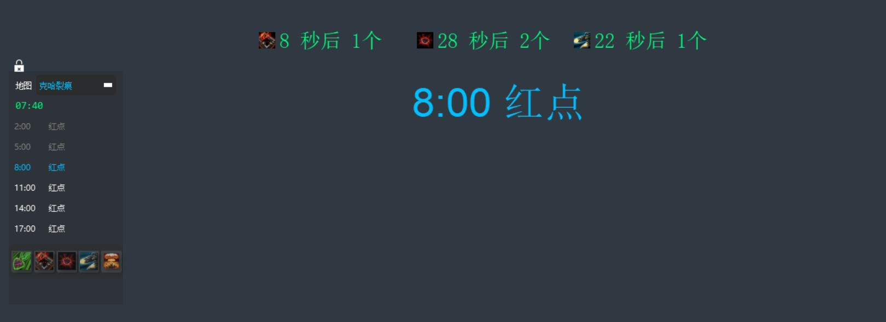
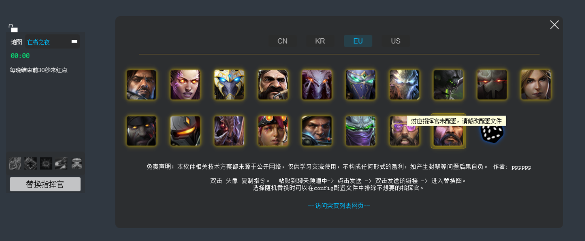

# SC2 Expo
Git: https://github.com/ylkangpeter/sc2-expo

[English Version](#english) | [中文版本](#chinese)

<a name="chinese"></a>
## 项目简介
SC2 Expo 是一个星际争霸2游戏辅助工具，主要功能包括：
- 游戏地图识别和定时提醒（地图识别部分代码源自 https://github.com/FluffyMaguro/SC2_Coop_Overlay）
- 游戏画面截图和部队识别功能
- 支持自定义提醒和快捷键设置

## 环境要求
- Python 3.7 或更高版本
- Windows 操作系统

## 安装步骤
1. 使用国内镜像源安装依赖（推荐）：
```bash
pip install -r requirements.txt -i https://pypi.tuna.tsinghua.edu.cn/simple
```

2. 或者使用默认源安装：
```bash
pip install -r requirements.txt
```

## 启动方式
双击 `start.vbs` 文件即可启动程序。

## 打包说明
### 使用PyInstaller打包（build_exe.py）
```bash
# 默认打包（单文件模式）
python build_exe.py

# 分离依赖库模式打包（推荐，启动更快）
python build_exe.py --separate-libs

# 使用UPX压缩（可选）
python build_exe.py --use-upx
```
## 配置说明
在 `src/config.py` 文件中可以修改以下配置项：
在 resource目录下编辑文件内容，来做具体的提醒，红点相关资料参考 https://bbs.nga.cn/read.php?tid=17265336&rand=787

### 调试相关
- `DEBUG_MODE`：调试模式开关（True/False）
- `LOG_LEVEL`：日志级别（'INFO'/'DEBUG'/'WARNING'/'ERROR'）

### 提示窗口设置
- `TOAST_DURATION`：Toast提示窗口显示时间（毫秒）
- `TOAST_OPACITY`：Toast窗口背景透明度（0-255）
- `TOAST_POSITION`：Toast窗口垂直位置（窗口高度的比例，0-1）
  
### 时间提醒设置
- `TIME_ALERT_SECONDS`：提前提醒时间（秒）

### 其他设置
其他更多设置，详见config.py文件

### AB图添加快捷键功能
神庙、虚空撕裂等图，会显示AB图的选项，可以点选，或者通过快捷键 ctrl + shift + [ 来改变状态，快捷键修改详见config.py

## 界面预览






## 注意事项
1. 确保游戏窗口可见，不要最小化
2. 程序会在系统托盘显示图标
3. 可以通过托盘图标右键菜单退出程序

---

<a name="english"></a>
# SC2 Expo

## Project Introduction
SC2 Expo is a StarCraft 2 game assistant tool with the following features:
- Game map identification and timing reminders (map identification code sourced from https://github.com/FluffyMaguro/SC2_Coop_Overlay)
- Game screenshot capture and troop identification
- Customizable reminders and hotkey settings

## Requirements
- Python 3.7 or higher
- Windows operating system

## Installation
1. Install dependencies using Chinese mirror (recommended):
```bash
pip install -r requirements.txt
```

2. Or install using default source:
```bash
pip install -r requirements.txt
```

## Launch
Double-click the `start.vbs` file to start the program.

## Build Instructions
### Using PyInstaller (build_exe.py)
```bash
# Default build (single file mode)
python build_exe.py

# Separate libraries mode (recommended, faster startup)
python build_exe.py --separate-libs

# Use UPX compression (optional)
python build_exe.py --use-upx
```

## Configuration
You can modify the following settings in the `src/config.py` file:
Edit the content in the resource directory for specific reminders. For red dot related information, refer to https://bbs.nga.cn/read.php?tid=17265336&rand=787

### Debug Settings
- `DEBUG_MODE`: Debug mode switch (True/False)
- `LOG_LEVEL`: Log level ('INFO'/'DEBUG'/'WARNING'/'ERROR')

### Toast Window Settings
- `TOAST_DURATION`: Toast window display duration (milliseconds)
- `TOAST_OPACITY`: Toast window background opacity (0-255)
- `TOAST_POSITION`: Toast window vertical position (window height ratio, 0-1)

### Time Alert Settings
- `TIME_ALERT_SECONDS`: Advance reminder time (seconds)

### Other Settings
For more settings, please refer to the config.py file

### AB Map Hotkey Feature
For maps like Temple and Void Thrashers, AB map options will be displayed. You can either click to select or use the hotkey ctrl + shift + [ to change the state. Hotkey modifications can be found in config.py

## Interface Preview


## Notes
1. Ensure the game window is visible, do not minimize
2. The program will display an icon in the system tray
3. You can exit the program through the tray icon right-click menu
